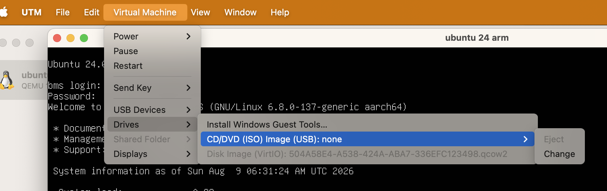
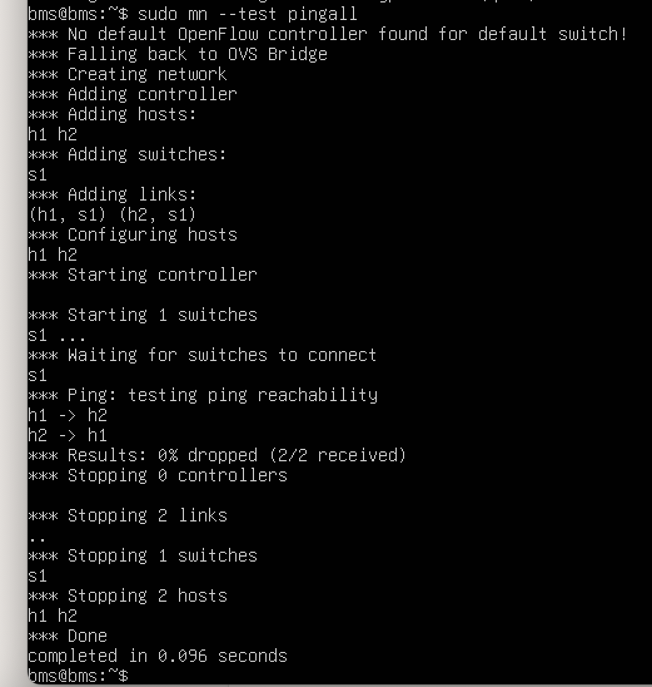

# Mininet on Apple M4 using UTM with Ubuntu 24.04

<small><u>August 9, 2026</u></small>

This guide sets up Mininet in an ARM64 Ubuntu virtual machine on an Apple M4 Mac.

## Virtualization vs. emulation in UTM

A UTM VM is a computer implemented in software. UTM provides its CPU, RAM, disk, network card, and display, then runs a guest operating system inside it.

- **Virtualization** is used when the guest CPU architecture matches the host. Most guest instructions execute directly on the physical CPU, so performance is near-native.
- **Emulation** is used when the architectures differ. UTM/QEMU must translate instructions, which is considerably slower.

An M4 Mac uses **ARM64 (AArch64)**. An ARM64 Ubuntu VM can therefore be virtualized:

```text
ARM64 Ubuntu VM
      ↓
ARM64 instructions
      ↓
M4 ARM64 CPU
```

By contrast, the prebuilt Mininet VM is named `mininet-vm-x86_64.vmdk` and expects an x86-64 CPU. Running it on an M4 requires emulation:

```text
x86-64 Ubuntu
     ↓
x86 instructions
     ↓
UTM/QEMU translation
     ↓
ARM64 instructions
     ↓
M4 CPU
```

The practical rule is: **M4 Mac + ARM64 Linux = fast virtualization; M4 Mac + x86-64 Mininet VM = slower emulation.**

## Install Ubuntu in UTM

1. [Download UTM](https://mac.getutm.app/).
2. Download the Ubuntu 24.04 Server ISO for ARM64.
3. Create a new VM in UTM with these settings:
   - Select **Virtualize** because both the host and guest use ARM64.
   - Memory: **6144 MB**
   - CPU cores: **4**
   - Display: **enabled**
   - Boot ISO image: select the downloaded Ubuntu ISO.
   - Storage: **10 GB**
   - Shared directory: skip.
4. Start the VM and follow the Ubuntu installation prompts.
5. Let the installer finish, including the `curtin` step, then select **Reboot**.
6. If reboot fails and asks you to eject the CD, select **VM → Drive → CD → Eject** from the toolbar.

   

7. Return to the VM and press **Enter**. Ubuntu should now boot normally.

## Install Mininet

Run:

```bash
sudo apt update
sudo apt install mininet
sudo mn --test pingall
```

A successful test looks like this:



You now have UTM, an Ubuntu 24.04 ARM64 VM, and Mininet installed.

---

<small style="color: #94a3b8;">Enhanced with AI</small>
